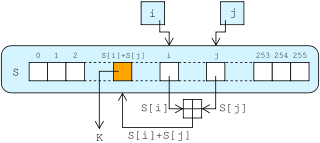

# RC4 算法
RC4(Rivest Cipher 4)是一种密钥长度可变的串流加密法，也是对称加密算法。RC4算法由伪随机数生成和异或运算组成。RC4的密钥长度范围是1-255。

## 密钥调度算法(KSA)
密钥调度算法用于初始化S盒。

伪码：
```
for i from 0 to 255
    S[i] := i
endfor
j := 0
for i from 0 to 255
    j := (j + S[i] + key[i mod keylength]) mod 256
    swap values of S[i] and S[j]
endfor
```
## 伪随机数生成算法(PRGA)
算法图解


伪码：
```
i := 0
j := 0
while GeneratingOutput:
    i := (i + 1) mod 256
    j := (j + S[i]) mod 256
    swap values of S[i] and S[j]
    K := S[(S[i] + S[j]) mod 256]
    output K
endwhile
```
该算法会生成一个与明文长度相等的伪随机数流，它们与明文进行异或运算得到密文。