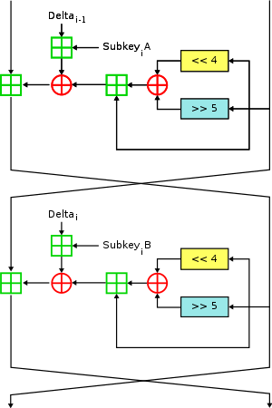

# XTEA 算法

## 算法介绍

XTEA(eXtended TEA)是旨在纠正TEA算法弱点的分块加密算法，和TEA算法一样，XTEA是Feistel结构的分块算法，使用一个delta常数，一次可加密64-bit数据，使用一个128-bit的key，推荐加密轮数为64轮。

## 加密

### 加密过程图示

### 伪码表示

L' = L + (((R << 4) ^ (R >> 5)) + R) ^ (delta' + key[delta & 3])

R' = R + (((L' << 4) ^ (L' >> 5)) + L) ^ (delta' + key[(delta' >> 11) & 3])

## 解密

和TEA相同，XTEA的解密过程即是加密过程的逆过程

### 伪码表示

R = R’ - (((L' << 4) ^ (L' >> 5)) + L) ^ (delta' + key[(delta' >> 11) & 3])

L = L‘ - (((R << 4) ^ (R >> 5)) + R) ^ (delta' + key[delta & 3])
